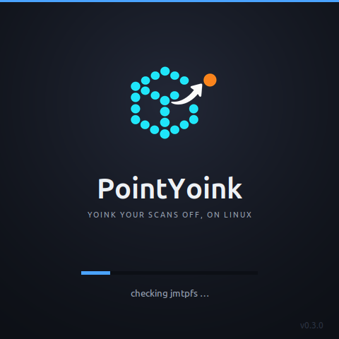
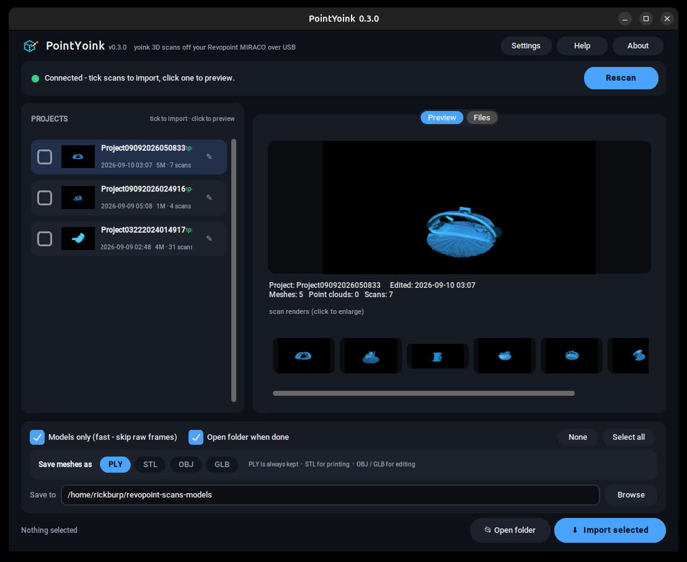

# PointYoink

[](https://github.com/datboip/pointyoink/releases)
[](https://github.com/datboip/pointyoink/releases)
[](https://github.com/datboip/pointyoink/stargazers)
[](LICENSE)


**Get your Revopoint MIRACO 3D scans onto Linux, without Revo Scan, Wine, or a Windows VM.**

Revopoint's Revo Scan software is Windows, macOS, iOS and Android only. There is no Linux version, so getting your finished scans off a MIRACO on a Linux machine usually means dual-booting, running a Windows VM, or fighting a raw MTP copy that drags thousands of tiny files across a slow connection.

PointYoink is a small desktop app that does it directly. Put the scanner in File Transfer mode, and PointYoink mounts it, shows your projects with the scanner's own preview renders, and copies the ones you pick straight to a folder. The output is standard `.ply` meshes and point clouds you can open in Blender, MeshLab, or CloudCompare.

> Unofficial. Not affiliated with or endorsed by Revopoint. "Revopoint" and "MIRACO" are trademarks of their respective owners. PointYoink only reads files off your own device and contains none of Revopoint's software.

## Screenshots

<p align="center">
  
</p>

<p align="center">
  
</p>

## What it does

- Detects the scanner and its File Transfer (MTP) mode, and connects automatically.
- Lists your projects with thumbnails, dates, scan counts, and sizes.
- Shows the scanner's own preview render for each scan, and opens any mesh in an interactive 3D viewer (rotate/zoom).
- Copies just the finished models by default, so you move megabytes instead of gigabytes. Or turn that off to pull the full project including raw frames.
- Optionally exports the meshes to STL, OBJ, or GLB on import.
- Rename a project to something readable. The original scanner ID stays as the folder name and reference, so nothing is lost.
- Remembers what you have already imported, across sessions, and asks before importing it again.
- Export any project as a single .zip for archiving or sharing.
- Cancel and retry, per-project progress, an import summary, and a dark UI.
- Built-in error log to make bug reports easy.

## Why not just...

| Option | What it is | Why it falls short for a MIRACO on Linux |
|---|---|---|
| Revo Scan under Wine | The Windows app via Wine | Launches but usually cannot see the scanner over USB; version 5/6 crash. |
| Windows VM | A full Windows guest | Works but heavy, and USB passthrough is fiddly. Overkill for copying files. |
| jmtpfs / gvfs by hand | Mount MTP, copy manually | Works, but you drag every raw depth frame through slow MTP and have to know which folders to skip. |
| android-file-transfer | Generic Android MTP tool | No idea what a scan project is, so it copies everything, slowly. |
| revopoint-python | Controls an older Pop/MINI over WiFi | A live-capture tool for tethered scanners, not a MIRACO extractor. |

PointYoink is the one that understands the MIRACO's on-device project layout and pulls only the finished meshes and point clouds.

## Supported scanners

- **MIRACO Pro** - tested and working (this is what PointYoink was built and verified against).
- **MIRACO and MIRACO Plus** - same standalone design, should work, but not yet confirmed. Reports welcome.

These are the standalone MIRACO models that store finished projects on the device and expose them over USB. Tethered scanners (POP, INSPIRE, RANGE, MINI, MetroX) are not supported, because those keep their data on whatever computer or phone ran Revo Scan, not on the scanner. If you have one of those, your files are already on that machine.

## Requirements

- Linux with Python 3.10 or newer.
- System packages: `sudo apt install python3-tk python3-pil.imagetk jmtpfs rsync`
- Python packages: `pip install customtkinter pillow trimesh "pyglet<2"`
- A USB-C **data** cable. Some bundled cables only charge. If nothing shows up, try a different cable.

## Install

### Debian / Ubuntu (recommended)

Download the latest `.deb` from [Releases](https://github.com/datboip/pointyoink/releases), then install it (this pulls in the dependencies automatically):

```bash
sudo apt install ./pointyoink_0.5.1_all.deb
```

PointYoink then shows up in your application menu - launch it from there, or run `pointyoink`. No pip, no virtualenv.

### From source (any distro)

```bash
sudo apt install python3-tk python3-pil.imagetk jmtpfs rsync
git clone https://github.com/datboip/pointyoink
cd pointyoink
python3 -m venv --system-site-packages venv
./venv/bin/pip install customtkinter pillow trimesh "pyglet<2"
./venv/bin/python pointyoink.py
```

## How to use

1. Plug the scanner into the PC with a USB-C data cable.
2. On the scanner screen, tap **File Transfer** (Share to PC, USB Cable).
3. PointYoink connects on its own. Your projects appear on the left.
4. Tick the projects you want. Click one to preview its scans.
5. Choose a **Save to** folder and click **Import selected**.

**Models only** (on by default) copies the finished `.ply` meshes and point clouds and skips the raw depth frames. Turn it off only if you want the raw frames to reprocess a scan later in Revo Scan on another machine.

## How it works

A MIRACO project holds thousands of raw depth frames plus the finished, fused output. The raw frames are the bulk of the size and are only needed to re-fuse a scan. PointYoink copies just the finished output, so an import moves a few megabytes instead of gigabytes. It still uses `jmtpfs` underneath; the speed comes from not moving the data you do not need.

Output files:

- `fuse_mesh.ply` - the finished mesh, with faces. This is what you print or render.
- `fuse.ply` - the fused point cloud, points only.

Both are standard binary PLY and open in Blender, MeshLab, or CloudCompare.

## Troubleshooting

- **Nothing detected:** make sure you tapped File Transfer on the scanner, not just plugged it in. Try a different USB-C cable, since some only charge.
- **Connect fails or hangs:** unplug and replug, tap File Transfer again. PointYoink clears stale connections on its own.
- **Previews are blank:** the scanner is still waking up. Click the project again.
- Anything else: open **Log** in the app, copy it, and file an issue.

## Roadmap

- A **Live** tab showing the scanner's real-time orientation and position (the MIRACO streams pose and IMU data over WiFi).
- Wireless transfer over WiFi, so you don't need the USB cable.
- Confirm the base MIRACO and MIRACO Plus, and document any differences from the Pro.

## Privacy

Everything happens locally over USB. Nothing is uploaded anywhere.

## Contributing

Issues and pull requests are welcome, especially test reports from MIRACO Pro and Plus owners.

## License

MIT. See [LICENSE](LICENSE).

## Built with

`jmtpfs` and `libmtp` (device access), `rsync` (transfer), CustomTkinter and Pillow (UI), and `trimesh` (STL/OBJ/GLB export). PointYoink contains no code from other Revopoint tools - the MIRACO project layout was worked out directly.

## Related projects

Different scanners or different problems, listed so you can find the right tool if PointYoink isn't the fit:

- [HazenBabcock/revopoint-python](https://github.com/HazenBabcock/revopoint-python) - live control and capture of older **tethered** scanners (POP/MINI) over Wi-Fi.
- [ifilipis/metrox](https://github.com/ifilipis/metrox) - reverse-engineering and raw-frame processing for the **MetroX**, from PC-cached project files.
- [frostworx/revopoint-pop2-linux-info](https://github.com/frostworx/revopoint-pop2-linux-info) - notes on running a **POP2** on Linux (Wine/SSH).

---

Keywords: revopoint linux, revo scan linux, miraco linux, revopoint miraco linux, miraco pro linux, transfer miraco scans to linux, get files off miraco linux, revopoint mtp linux, revopoint ply export linux, revopoint no linux version, 3d scanner linux.
